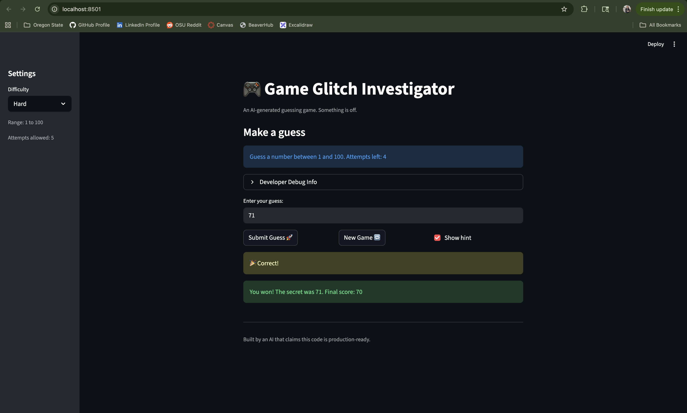

# 🎮 Game Glitch Investigator: The Impossible Guesser

## 🚨 The Situation

You asked an AI to build a simple "Number Guessing Game" using Streamlit.
It wrote the code, ran away, and now the game is unplayable. 

- You can't win.
- The hints lie to you.
- The secret number seems to have commitment issues.

## 🛠️ Setup

1. Install dependencies: `pip install -r requirements.txt`
2. Run the broken app: `python -m streamlit run app.py`

## 🕵️‍♂️ Your Mission

1. **Play the game.** Open the "Developer Debug Info" tab in the app to see the secret number. Try to win.
2. **Find the State Bug.** Why does the secret number change every time you click "Submit"? Ask ChatGPT: *"How do I keep a variable from resetting in Streamlit when I click a button?"*
3. **Fix the Logic.** The hints ("Higher/Lower") are wrong. Fix them.
4. **Refactor & Test.** - Move the logic into `logic_utils.py`.
   - Run `pytest` in your terminal.
   - Keep fixing until all tests pass!

## 📝 Document Your Experience

- [ ] The games purpose is to guess a number between three difficulties: easy, normal, and hard. Depending on which difficulty, the user can get points on how close they are to the number. Each incorrect guess the player loses points. The player can start new games afterward and receive hints during the game. 
- [ ] I found two bugs: 
   - The first bug was that the settings for the game did not display the correct values. Easy/Normal/Hard were something like 1-20, 1-100, 1-50, where it should be 1-20, 1-50, 1-100. 
   - The second bug was that the score for the player went below 0. This shouldn't be possible in a game like this. If the player gets a score that drops the score below 0, it should reset back to 0. 
- [ ] Explain what fixes you applied.
   - Using Claude Code, I had claude go through and first understand the code files using the "@" symbol. Once it understood the context, I told it what exactly was going wrong with the file. It gave me the following suggestions for the code changes:
      - Change 'low' string to `low` variable and 'high' string to `high` variable instead of hardcoding. This wasn't the error specifically, but it was still an error. I had to manually change the user settings as described in "I found two bugs".
      - For the second bug, it actually corrected it and put "max(current_score - 5, 0) for both the "too high" and "too low" values. This was correct, it just should have combined both into one to make it more readable. 

## 📸 Demo

- 

## 🚀 Stretch Features

- [ ] [If you choose to complete Challenge 4, insert a screenshot of your Enhanced Game UI here]
